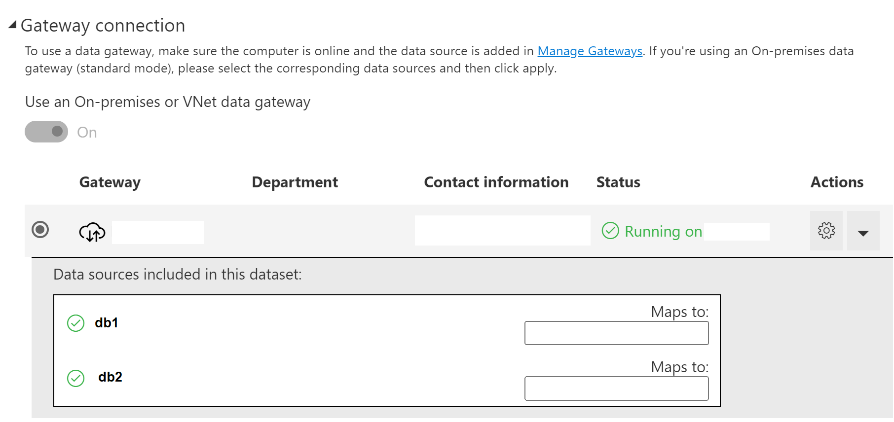
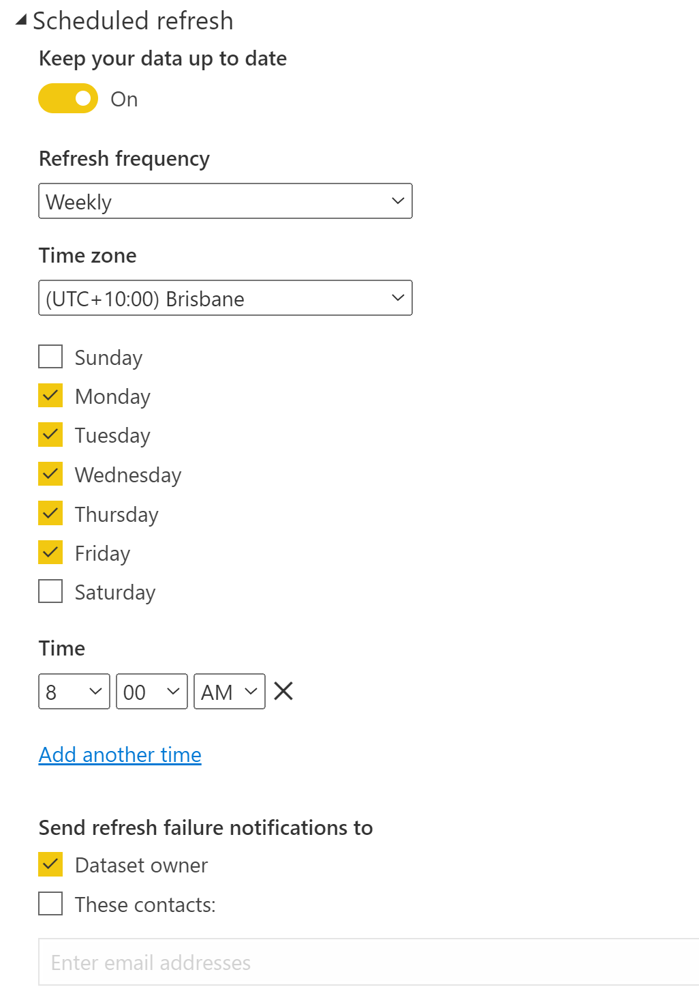
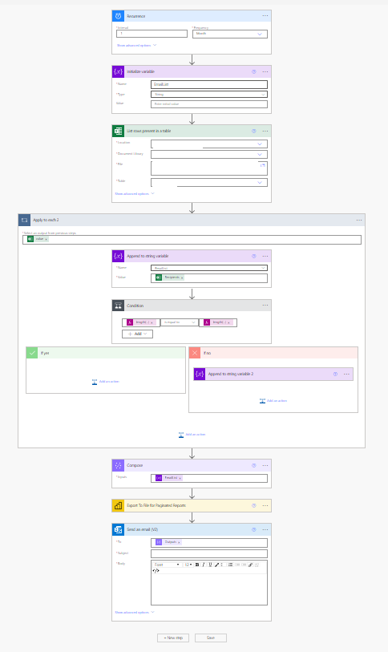
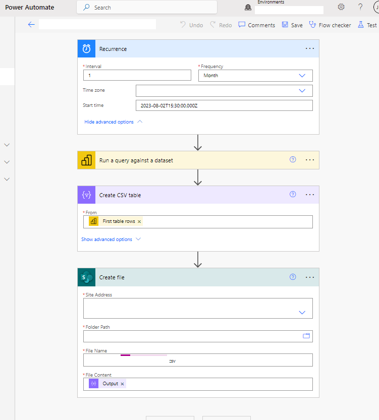

# What is this place??
__A repo containing code for the Power BI environment. DO NOT Upload .pbix files!!__

# Reporting Guide for Data Analysts
This PowerBI delivery article is based on content from Andrew Robinson @SKEDA's original knowledge base article

## 00 Scoping and Requests
Requests for new reports and interactive dashboards should come in through the Jira ticketing system, which provides workflow intergration, approvals and triage. 
There are two Jira request forms, which cover both flat "__Paginated Reports__" and "__Interactive Reports__": 
- New report - LINK 1 HERE
- Change something already existing - LINK 2 HERE

I (JM) then convert the Jira form output into the following requirements template. This is self developed for me, DIY or steal!

    Ticket No: 
    
    Purpose:
        1. 

    Audience:
    - Internal
		a. 
	- External
        b. 

    Design features
        - 

    Graphs desired: 
        - 

    Tables desired
        - Table 1
            1. Countable:
                ○ 
            2. Disaggregations:
                ○ 
        - ...

    Data sources:
    Refresh frequency: [Daily, 2+/week, Weekly, Monthly, Quarterly…]

    Primary
        - 
    Secondary
        - 


## 01 For initial development
__Develop reports in the desktop client, not on the portal.__ Create a pbix file you work in and save it locally before it's uploaded to the portal. As you're developing, at milestones export the file as a template, into a version controlled folder pulling from this Repo, so we can make annoated changes and rollback to a previous version if we have a problem with the report.

__Once your pbix file is ready for testing in the portal, please publish it to the `Dev/UAT Workspace`.__ If you don't have access please request it. Don't publish to your personal workspace as it makes it more difficult to share development and if you leave all the reports will have to be downloaded from your workspace and republished to somewhere else. 
You can share the report/data set from within the Dev workspace to others for testing. In general, only devs should have overall access to the dev workspace (_it would be nice that we can assume publishing to dev will not automatically give non-devs access to the report so we should keep permissions granular in the dev site - users only get direct access to the report/dataset/dashboard_). 


## 02 Data sources - using the gateway
__PowerBI is setup with a data gateway which allows for data sets to be refreshed by the platform.__ This allows users to view reports and datasets without requiring them to have permission to the data sources (the sql servers or other data sources). 
The gateway can have multiple data sources setup.

In order to have your powerBI data source work through the gateway, your data source settings MUST match the gateway data source settings EXACTLY:

​Server     | Database​
-----------|------------------
Address1   |​   db1
Address2   |   db2
Address3   |   db3

Once you have created your data source in your report using the above details, and you publish the report to the PBI Platform (_online "Service"_), you have to edit the Data Set and enable the system to use the gateway source. To do that, access the PBI Portal and find your data set, edit the data set settings and you should see the option to enable the use of data gateway for your report's data set.



If you don't see this option then you either;
    1. don't have permissions to the data gateway source or 
    2. you don't have the identical names for server and database.

Once you have the data gateway option enabled, you have to map your data sources to the data gateway sources using the drop lists.

You should also setup the refresh schedule as per the image below;



There is a maximum of 8 times per 24 hrs that you can set. The default is every 24 hrs. Times closer than 1 hr are not recommended as the platform only refreshes within the hour scheduled.
- The org datamart (dbo) only refreshes once per day, so there's not much point setting it more than once per day unless you're accessing the CRM (_which we're not scoped to do_)

You should also be able to test your data gateway refresh be running a Manual / OnDemand refresh on the Data Set.

## 03 Report Creation and conventions:

1. __Select the workspace for the report__
0. __Follow the naming conventions:__
    - Reports need a prefix i.e. _4.1 XXX_
    There is no need for a version / status suffix, as we are using version control and a Development & UAT workspace/app for published drafts. 
    If you have different names, publishing to the service will not override the existing files & carry over all the settings. You'll have to:
        - re-configure all the connection settings
        - add the report to the app
        - enable visibility of the report to each appropriate audience

    Modifier        |   Element
    ----------------|---------------
    Prefix - Where  |   Workspace no.
    Prefix - What   |   Report no. in workspace
    Name            |   Human friendly Title - keep this consistent with the in-report title

0. __Publish to the PowerBI (web) service__, within a workspace and set up gateway / refresh settings, per [above](#02-Data-sources---using-the-gateway)

0. __Add the required users within App audiences:__
    The intent is to have almost no-one in the workspaces themselves, besides backend staff. This allows us to run access with Azure AD groups, ensure no-one has links to files which get removed/overridden, and provide needs-based visibility of different reports within each workspace/app. 

0. __External access:__
    External actors are not being provided with access to PowerBI reports, as that would require DA to provision them a license, or provide them with Azure AD authentication. 
    Instead, external actors are to be provided with Paginated Reports, which can be set to automatically distribute/save using Power Automate connections. 

    - ___Previous settings for context:___ 
    ~~If there are external people needing access to the dashboard, a copy of that dashboard should be placed in a workspace set up specifically and exclusively for that organisation. 
    This does mean updates will need to be pushed to two+ workspaces. The designer will need to be aware (and record) where each dash sits to ensure the parallel instances are kept in alignment~~

## 04 Power BI Interactive Reports
0. __Templates:__
    - Open the PowerBI template `./Power BI Template 0.1.pbix`, and save into a local non-VC'ed folder. This will create your local `.pbix`, which you'll develop and publish to "Power BI (web) service". 
    - Import the colour themes from `./YOUR_THEME.json`
    - Import your data sources as Direct Query if they're not processed APIs or another PowerBI dataset
0. __Query creation:__
    - You can copy tables from other PowerBI files inside the `Transform` menu. 
    - Sources should be parameterised as `Source = Sql.Database(Server, Database)`, instead of the default fullname;
        ``` dax
        // Server
        "db_address" meta [IsParameterQuery=true, List={"db_address"}, DefaultValue="db_address", Type="Any", IsParameterQueryRequired=true]
        ```
        
        ``` dax
        // Database
        "PROD_DB_NAME" meta [IsParameterQuery=true, List={"DEV_DB_NAME", "UAT_DB_NAME", "PROD_DB_NAME"}, DefaultValue="PROD_DB_NAME", Type="Any", IsParameterQueryRequired=true]
        ```
        This is to allow quick swaps to Dev instances of the datamart for testing ETL changes. 
    - Once you have tables established, you can use Tabular editor to copy Measures and Relationships between PowerBI models _(open `.pbix` and any `.pbit` file (open or not))_
0. __Visual elements:__
    - All elements have a "no-fill" background. 
    - Element groups share a  backgrounded "grouping rectangle" shape, with an applied shadow effect and a 10pt wide border.
        - I've been using different coloured borders to visually seperate element groups by type. _i.e. all headers and primary content are , all slicers/toggles are , and reset buttons are_ . 

## 05 Paginated Reports
0. __Templates:__
    - Refer to the wireframe `./ExternalReports/Paginated Report wireframe.svg` and paginated report doco `./ExternalReports/Paginated Report Doco.md`

0. __Query creation:__
    - Try to keep only the cols you need, extra columns tend to cause a meltdown, especially if they contain `NULL` values, even if they're not being returned in the table/graph
    TODO

0. __Saving:__ Save our paginated report into `./ExternalReports`, subject to the naming conventions, as [above](#03-Report-Creation-and-conventions)

0. __Power Automate intergration:__
A Power Automate flow is created to trigger and run the Paginated Report, which is limited to once per 5mins (_under our PPU licences_), and distribution of the report. This flow should be named with the same name or at least same prefix as the associated Paginated Report. 
Steps:
    - a recurrence || on-action trigger is set up 
    - Distribution
        - a variable is decleared to hold the e-mail receipients
        - the distribution list (DL) is read from the associated reference file _(this is so we can edit something simple, rather than requiring a dev to edit (and potentially break) the flow each time the DL changes)_
        - the DL variable is iteratively added to with all members of the DL from ^^
        - this is then composed to a single string to pass as addressees
    - a query is run Paginated Report, including with any parameters, with a specified format
    - An email is sent to the DL members, containing the contents of the paginated report

    

0. Export your working flow as a `Zip` "package", and save it into the `./ExternalReports` folder of this repo, so that it too is version-controlled; 


## 06 Periodic Data Extracts
__These should be done as in-frequently as possible, and subject to a program-director level approval and data-sharing agreement/contract review!!__
While it is possible to supply external partners with raw/sanitised data, your org risks that data being taken and mis-represented or shared without our knowledge. To avoid this, raw/sanitised data releases should be avoided unless absolutely required. 

your org has a number of complex process interactions, caveats and business rules around what counts as _X_ for various purposes, so data summarisations should be done in-house where possible, to ensure the data is presented and interpretted correctly. 

__Additionally, your org holds a great deal of personally identifying information (PII) and private/sensitive medical data, so the release method and audience must be carefully considered__, including security in-transit. Even data with identifiers and obvious personal information like names, e-mails and addresses can still be identifying, due to the number of demographic factors captured in the your org datamart. 

> It's important researchers are aware that data that is not obviously sensitive (no names or dates of birth for example) or that has been de-identified, can become sensitive through triangulation or data linkage.
>> Triangulation in this context is the process of combining several pieces of non-sensitive information (in the same dataset) to determine the identity or sensitivity of a participant or subject.

Some resources:
- [Australian Research Data Commons - Identifiable Data](https://ardc.edu.au/resource/identifiable-data/)
- [James Cook University Australia - De-identifying Data 01](https://www.jcu.edu.au/rdim/step-3-archive/you-will-need-to-consider/de-identifying-data)
- [James Cook University Australia - De-identifying Data 02](https://www.jcu.edu.au/rdim/step-1-plan/you-will-need-to-consider/triangulation)

__Process:__
1. a PowerBI dataset should be identified or created to supply the required data, with approriate transformations/index-lookups applied. 
0. this dataset is published to the external reports workspace; `
External Reports PPU`
0. a SharePoint folder is created in a shared access space, to ensure authentication and authorisation, _i.e. a locked down folder inside `SharePoint`_
0. a Power Automate flow is created to trigger and run the extraction and distribution of the data. This flow should be named with the same name or at least same prefix as the associated PowerBI dataset. 
    - a recurrence is set up
    - a query is run against the dataset (use PowerBI's `Optimise %<% performance analyser` for this)
    - a CSV table is created from this query return
    - the file is saved into the ^^ SharePoint site folder, with an appropriate name (including execution time)

    

## 07 Post Creation Steps
__If report is new:__ Submit a ticket to add the new report to the "list of reports" list in Jira - LINK 3 , so clients can select it in "Request changes to a report" tickets

-----------------------------------------
# Setting up ReadMe's

## Getting Started
TODO: Guide users through getting your code up and running on their own system. In this section you can talk about:
1.	Installation process
2.	Software dependencies
3.	Latest releases
4.	API references

## Build and Test
TODO: Describe and show how to build your code and run the tests. 

## Contribute
TODO: Explain how other users and developers can contribute to make your code better. 

If you want to learn more about creating good readme files then refer the following [guidelines](https://docs.microsoft.com/en-us/azure/devops/repos/git/create-a-readme?view=azure-devops). You can also seek inspiration from the below readme files:
- [ASP.NET Core](https://github.com/aspnet/Home)
- [Visual Studio Code](https://github.com/Microsoft/vscode)
- [Chakra Core](https://github.com/Microsoft/ChakraCore)
- [Markdown formatting](https://learn.microsoft.com/en-us/azure/devops/project/wiki/markdown-guidance?view=azure-devops)
